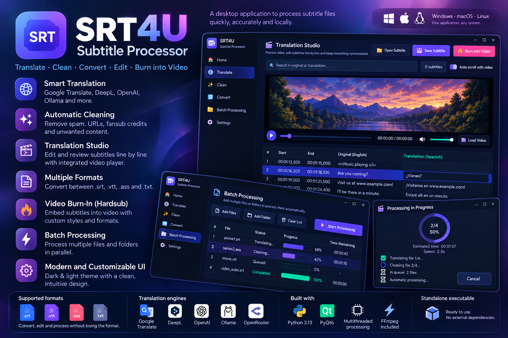

# SRT4U - Subtitle Processor

[](LICENSE)
[](https://python.org)
[](https://pypi.org/project/PyQt6/)
[]()
[]()

[**English**](README.md) | [**Español**](README_es.md)

Desktop app to translate, edit, clean, and convert subtitle files (`.srt`, `.vtt`, `.ass`, `.txt`) with a real-time synchronized video player and direct video burn-in export.



---

## Features

- **Multi-language Interface (i18n)**:
  - Automatic system language detection on startup via `QLocale`.
  - Live on-the-fly language switching without restarting the app.
  - 6 supported languages: English (`en`), Spanish (`es`), Portuguese (`pt`), German (`de`), Italian (`it`), and Simplified Chinese (`zh-CN`).
  - Dual access: Quick switcher in the top bar and persistent selection in the Settings page.
- **Video Burn-In (Hardsub Export)**:
  - Permanently embeds subtitles into video files (`.mp4`, `.mkv`, `.webm`, etc.).
  - Visual customization: Font size, color (White, Yellow, Cyan), and reading boxes (Semitransparent, Solid, or Border outline).
  - Adaptive resolution rendering: Subtitles scale proportionally to video height (from 480p to 4K and vertical Reels/TikTok).
  - Automatic overlap sanitizer: Prevents overlapping subtitle timecodes from colliding on screen.
  - Real-time progress modal with encoding speed (x), elapsed time, and ETA.
- **Interactive Translation Studio**:
  - Live side-by-side card editor to review and refine translations line-by-line.
  - Synchronized with the built-in video player (click any subtitle to seek to that video frame).
  - Search and filter cues instantly.
- **Translation Engines**:
  - Google Translate: Built-in free tier with zero setup or API keys required.
  - DeepL: Free and Pro API key support.
  - OpenAI / Local LLMs: Compatible with OpenAI, Ollama, and OpenRouter endpoints.
- **Automated Cleaner**: Strips out Telegram channels (`t.me`), URLs, fansub credits, ads, and musical markers (`♪`) while preserving valid dialogue and formatting tags (`<i>`, `<b>`, ASS styles).
- **Format Converter**: Bi-directional conversion between `.srt`, `.vtt`, `.ass`, and plain text `.txt`.
- **Batch Processing**: Queue entire folders or multiple files with per-file progress tracking.
- **Parallel Execution**: Multi-threaded block translation to speed up large subtitle files.
- **Dark / Light Glass Theme**: Modern Glassmorphism UI with instant theme switching.

---

## Installation & Running

### Requirements
- Python 3.10 or higher
- `pip`

### Run from Source

```bash
# Clone the repository
git clone https://github.com/marodriguezd/SRT4U-Subtitle-Processor.git
cd SRT4U-Subtitle-Processor

# Create and activate virtual environment
python -m venv .venv
source .venv/bin/activate  # On Windows: .venv\Scripts\activate

# Install dependencies
pip install -r requirements.txt

# Run the application
python main.py
```

### Pre-built Standalone Binaries
Standalone portable binaries are built via GitHub Actions for every release tag. **They come bundled with a static standalone FFmpeg build, requiring zero external dependencies or setup**:
- **Windows**: `SRT4U-Windows-x64.exe` (Single self-contained `.exe`)
- **Linux**: `SRT4U-Linux-x86_64.AppImage` (Portable on any Linux distro)
- **macOS**: `SRT4U-macOS.dmg` (Universal binary for Apple Silicon M1-M4 and Intel)

---

## Running Tests

The test suite covers parsing, cleaning, cross-format conversion, free translation, and UI flows:

```bash
pytest tests/ -v
```

---

## Supported Formats

| Format | Extension | Read | Write | Style Preservation |
|---|---|:---:|:---:|:---:|
| SubRip Subtitle | `.srt` | Yes | Yes | Yes (HTML tags) |
| Web Video Text Tracks | `.vtt` | Yes | Yes | Yes (cue settings & tags) |
| Advanced SubStation Alpha | `.ass` / `.ssa` | Yes | Yes | Yes (styles & positions) |
| Plain Text Dialogue | `.txt` | Yes | Yes | Lines only |

---

## License

This project is licensed under the [Creative Commons Attribution-NonCommercial-ShareAlike 4.0 International License (CC BY-NC-SA 4.0)](LICENSE).