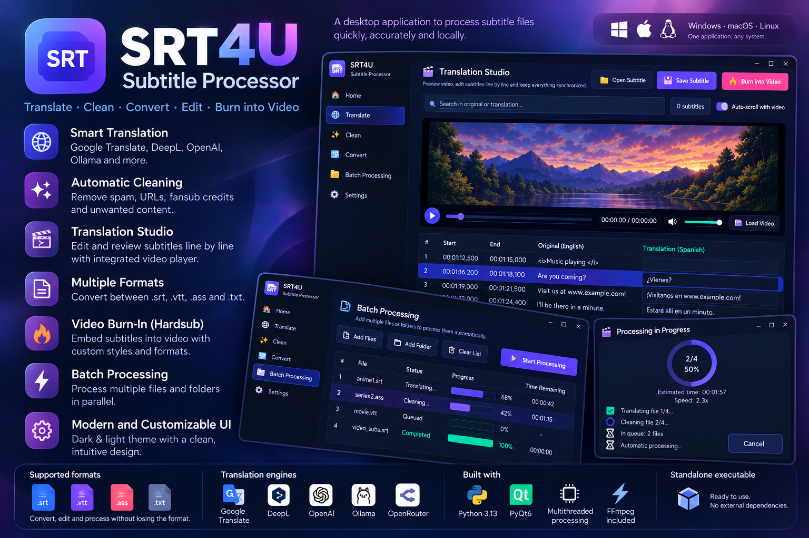

# SRT4U - Subtitle Processor

[](LICENSE)
[](https://python.org)
[](https://pypi.org/project/PyQt6/)
[]()
[]()

[**English**](README.md) | [**Español**](README_es.md)

Desktop app to translate, edit, clean, and convert subtitle files (`.srt`, `.vtt`, `.ass`, `.txt`) with a real-time synchronized video player and direct video burn-in export.



---

## Features

- **Multi-language Interface (i18n)**:
  - Automatic system language detection on startup via `QLocale`.
  - Live on-the-fly language switching without restarting the app.
  - 6 supported languages: English (`en`), Spanish (`es`), Portuguese (`pt`), German (`de`), Italian (`it`), and Simplified Chinese (`zh-CN`).
  - Dual access: Quick switcher in the top bar and persistent selection in the Settings page.
- **Video Burn-In (Hardsub Export)**:
  - Permanently embeds subtitles into video files (`.mp4`, `.mkv`, `.webm`, etc.).
  - Visual customization: Font size, color (White, Yellow, Cyan), and reading boxes (Semitransparent, Solid, or Border outline).
  - Adaptive resolution rendering: Subtitles scale proportionally to video height (from 480p to 4K and vertical Reels/TikTok).
  - Automatic overlap sanitizer: Prevents overlapping subtitle timecodes from colliding on screen.
  - Real-time progress modal with encoding speed (x), elapsed time, and ETA.
- **Interactive Translation Studio**:
  - Live side-by-side card editor to review and refine translations line-by-line.
  - Synchronized with the built-in video player (click any subtitle to seek to that video frame).
  - Search and filter cues instantly.
- **Translation Engines**:
  - Google Translate: Built-in free tier with zero setup or API keys required.
  - DeepL: Free and Pro API key support.
  - OpenAI / Local LLMs: Compatible with OpenAI, Ollama, and OpenRouter endpoints.
- **Automated Cleaner**: Strips out Telegram channels (`t.me`), URLs, fansub credits, ads, and musical markers (`♪`) while preserving valid dialogue and formatting tags (`<i>`, `<b>`, ASS styles).
- **Format Converter**: Bi-directional conversion between `.srt`, `.vtt`, `.ass`, and plain text `.txt`.
- **Batch Processing**: Queue multiple files with per-file progress tracking.
- **Subtitle Analytics & deterministic QA**: grouped content/timing/quality metrics plus rule-based validation (`analyze`/`qa`, JSON/CSV).
- **Translation benchmarks**: reproducible provider comparison with JSON/CSV reports and offline analysis notebook.
- **Local SQLite history**: every execution recorded with aggregate metrics (History page, `history` CLI); no texts, keys, or media stored.
- **Local REST API** (optional `[api]` extra): `/api/v1` with analyze, QA, translate/process/transcribe/pipeline jobs, history, benchmarks, OpenAPI docs.
- **Local Whisper transcription** (optional `[transcription]` extra): audio/video → subtitles feeding analytics, QA, cleaning, translation, burn-in.
- **End-to-end media pipeline**: `srt4u pipeline` / Pipeline page / `POST /api/v1/pipeline` chaining transcription → cleaning → analytics → QA → optional translation → final QA → export → optional burn-in, with per-stage errors and cancellation.
- **Headless CLI**: Process batches, analyze subtitle metrics, and run deterministic QA with JSON/CSV exports without starting PyQt6.
- **Parallel Execution**: Multi-threaded block translation to speed up large subtitle files.
- **Dark / Light Glass Theme**: Modern Glassmorphism UI with instant theme switching.

---

## Installation & Running

### Requirements
- Python 3.10 or higher
- `pip`

### Run from Source

```bash
# Clone the repository
git clone https://github.com/marodriguezd/SRT4U-Subtitle-Processor.git
cd SRT4U-Subtitle-Processor

# Create and activate virtual environment
python -m venv .venv
source .venv/bin/activate  # On Windows: .venv\Scripts\activate

# Install dependencies (source-checkout path: same base stack as `pip install .`)
pip install -r requirements.txt

# Run the desktop application
python main.py

# Process without opening the UI
python -m application.cli process input.srt --output output.srt --clean
```

### Optional extras

```bash
pip install ".[api]"            # local REST API: srt4u serve (/api/v1, OpenAPI)
pip install ".[transcription]"  # local Whisper: srt4u transcribe / pipeline media
pip install ".[dev]"            # pytest + ruff for contributors
```

Base (GUI + CLI + analytics + QA + translation + history + pipeline over
subtitle inputs) ships with the base install — `pip install .` and
`pip install -r requirements.txt` both provide it, no extra needed. Whisper models are never bundled: they
download once with prior notice (`SRT4U_WHISPER_MODEL_DIR` relocates the cache).

### 60-second quickstart

```bash
python -m application.cli analyze input.srt --json
python -m application.cli qa input.srt --strict
python -m application.cli process input.srt --clean --translate --target en
python -m application.cli transcribe clip.mp4 --model small --language auto
python -m application.cli pipeline clip.mp4 --translate --target en -o out.srt --stats-json
python -m application.cli serve  # docs at http://127.0.0.1:8000/docs
```

Architecture (GUI/CLI/API → services → providers/SQLite/FFmpeg) and per-area
guides: [docs/cli.md](docs/cli.md), [docs/api.md](docs/api.md),
[docs/transcription.md](docs/transcription.md), [docs/pipeline.md](docs/pipeline.md),
[docs/database.md](docs/database.md), [docs/tech-debt.md](docs/tech-debt.md).

### Pre-built Standalone Binaries
Standalone portable binaries are built via GitHub Actions for every release tag. **They come bundled with a static standalone FFmpeg build, requiring zero external dependencies or setup**:
- **Windows**: `SRT4U-Windows-x64.exe` (Single self-contained `.exe`)
- **Linux**: `SRT4U-Linux-x86_64.AppImage` (Portable on any Linux distro)
- **macOS**: `SRT4U-macOS.dmg` (Universal binary for Apple Silicon M1-M4 and Intel)

---

## Headless CLI

The CLI reuses `SubtitleService` to clean, translate, convert formats, and process directories in batches without creating a Qt application. After installing the package, run `srt4u process`; from a checkout use `python -m application.cli process`. JSON presets and options such as `--translate --source auto --target es --engine ollama` are supported. See [docs/cli.md](docs/cli.md) for examples, preset keys, and output behavior.

## Analytics & QA

`analyze` calculates grouped content, timing, quality, and processing metrics. `qa` reports deterministic subtitle issues with configurable thresholds. Both commands support JSON; analytics can also be exported to CSV. See [docs/analytics.md](docs/analytics.md) for metric definitions, rule defaults, and CLI export examples.

## Translation providers & metrics

`TranslationService` dispatches through `ProviderRegistry` to `Google`, `DeepL`, or the OpenAI-compatible endpoint (`openai`, `llm`, and `ollama` aliases share the implementation; the requested name is preserved in metrics). Errors are normalized (`error_type`), retries are opt-in, and the historic DeepL/OpenAI→Google fallback is explicit and configurable. `translate_with_metrics()` returns `TranslationResult` with JSON-serializable `TranslationMetrics` (provider, model, languages, cues/chars/words, wall-time duration, retries, fallback, tokens when reported, `estimated_cost` stays `null`); the CLI prints them with `--stats` or `--stats-json`. `benchmark` runs a fixed dataset against several providers over N runs and exports JSON/CSV for offline analysis; `notebooks/benchmark_analysis.ipynb` + `analysis/benchmark_analysis.py` compute descriptive stats, variability, errors/fallback and plots into `reports/benchmark/`. Executions are recorded in a local SQLite history (`history` CLI, History page, `--store` for benchmarks). A local REST API (`srt4u serve`, FastAPI `[api]` extra) exposes analyze, QA, translate/process jobs, history and benchmarks over `/api/v1` with OpenAPI docs. Optional local Whisper transcription (`srt4u transcribe`, Transcribe page, `POST /api/v1/transcribe` jobs; `faster-whisper` `[transcription]` extra) turns audio/video into subtitles feeding Analytics, QA, cleaning, translation and burn-in. A `MediaPipeline` orchestrator (`srt4u pipeline`, Pipeline page, `POST /api/v1/pipeline` jobs) chains transcription/parse → cleaning → analytics → QA → optional translation → final QA → SRT/VTT export → optional burn-in with per-stage errors, cooperative cancellation and one main history record. See [docs/providers.md](docs/providers.md), [docs/benchmarking.md](docs/benchmarking.md), [docs/benchmark_analysis.md](docs/benchmark_analysis.md), [docs/database.md](docs/database.md), [docs/api.md](docs/api.md), [docs/transcription.md](docs/transcription.md) and [docs/pipeline.md](docs/pipeline.md).

## Running Tests

The test suite covers parsing, cleaning, cross-format conversion, free translation, UI flows, UI layout regression (clipped-text detection in 6 languages × 2 themes), and dialog geometry invariants:

```bash
pytest tests/ -m "not network"  # no network, keys, or Whisper models needed
```

---

## Developer Tools

### Screenshot Gallery Generator

`tools/regenerate_screenshots.py` regenerates the offscreen visual-verification gallery used during UI review: the main window pages (Home, Settings, About) × languages × dark/light themes, plus the burn-in dialog, progress modals, themed file dialog (dark/light) and message box per language.

```bash
QT_QPA_PLATFORM=offscreen python tools/regenerate_screenshots.py [--out DIR] [--langs en,es,...]
```

- Output defaults to `/tmp/srt4u-shots` (46 PNGs with the 6 UI languages); previous PNGs in the target directory are overwritten.
- The Qt offscreen platform is used when no display is available, and the FFmpeg burn-in worker is neutralized, so the tool is safe to run headless.
- Each dialog's resulting size and declared minimum size are printed as a quick geometry sanity check (`size == min` expected).
- The tool is protected against bit-rot by the `tests/test_screenshot_tool.py` smoke test, which runs it in a subprocess on every CI test job.

---

## Logs & Troubleshooting

Failures are written to a rotating log file (512 KB × 3) instead of being swallowed:

| Platform | Location |
|---|---|
| Windows | `%APPDATA%\SRT4U\srt4u.log` |
| macOS | `~/Library/Application Support/SRT4U/srt4u.log` |
| Linux | `~/.config/SRT4U/srt4u.log` (or `$XDG_CONFIG_HOME/SRT4U/srt4u.log`) |

It records configuration read/write failures, per-block translation engine errors, FFmpeg detection/duration/dimension problems, unexpected exceptions (with traceback) and the final exit code. Qt's own messages are routed there too (`qWarning`/`qCritical`/`qFatal`, and `qDebug`/`qInfo` at debug level), so multimedia/codec warnings and platform-plugin diagnostics show up alongside the app's own entries. When a failure is user-visible — settings not saved, incomplete translation, unreadable settings file, unhandled error — the app shows a dialog pointing to this file.

---

## Supported Formats

| Format | Extension | Read | Write | Style Preservation |
|---|---|:---:|:---:|:---:|
| SubRip Subtitle | `.srt` | Yes | Yes | Yes (HTML tags) |
| Web Video Text Tracks | `.vtt` | Yes | Yes | Yes (cue settings & tags) |
| Advanced SubStation Alpha | `.ass` / `.ssa` | Yes | Yes | Yes (styles & positions) |
| Plain Text Dialogue | `.txt` | Yes | Yes | Lines only |

---

## License

This project is licensed under the [Creative Commons Attribution-NonCommercial-ShareAlike 4.0 International License (CC BY-NC-SA 4.0)](LICENSE).