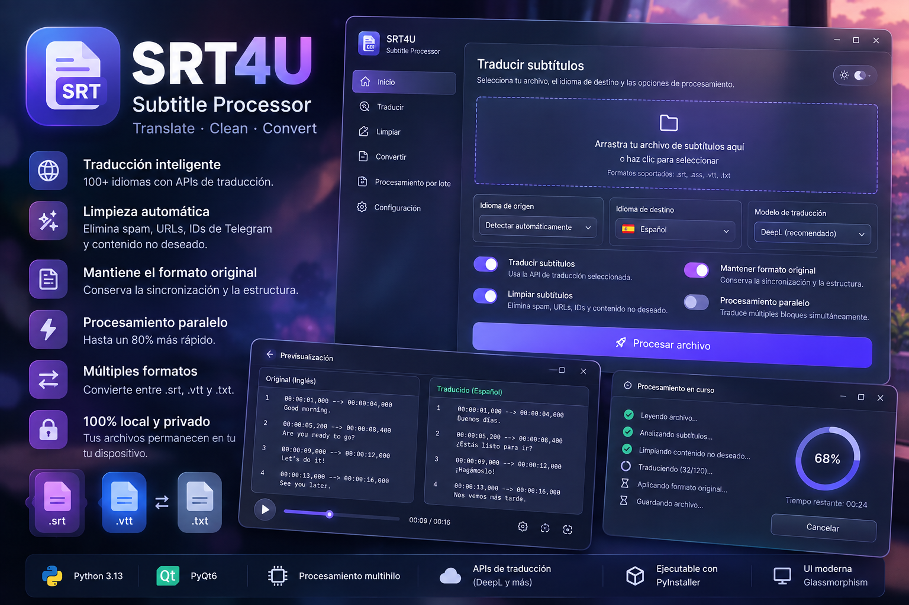

# SRT4U - Subtitle Processor

[](LICENSE)
[](https://python.org)
[](https://pypi.org/project/PyQt6/)
[]()
[]()

[**English**](README.md) | [**Español**](README_es.md)

Aplicación de escritorio para traducir, editar, limpiar y convertir archivos de subtítulos (`.srt`, `.vtt`, `.ass`, `.txt`) con reproductor de vídeo sincronizado en tiempo real e incrustación directa en vídeo (Burn-In / Hardsub).



---

## Funcionalidades principales

- **Incrustación en vídeo (Hardsub / Burn-In)**:
  - Quema los subtítulos de forma permanente dentro del archivo de vídeo (`.mp4`, `.mkv`, `.webm`, etc.).
  - Configuración visual personalizada: Tamaño tipográfico, color (Blanco, Amarillo, Cian) y caja de fondo (Caja semitransparente, sólida o solo contorno).
  - Escalado adaptativo según resolución: Los subtítulos mantienen la proporción visual óptima en cualquier resolución (desde 480p hasta 4K y formatos verticales de Reels/TikTok).
  - Corrección automática de solapamientos: Sanitizador que evita que subtítulos con tiempos superpuestos choquen o se monten en pantalla.
  - Modal de progreso en vivo con velocidad de codificación (x), tiempo transcurrido y tiempo restante estimado (ETA).
- **Estudio de traducción y edición interactiva**:
  - Editor en tarjetas divididas para revisar y afinar las traducciones línea por línea en caliente.
  - Sincronización bidireccional con el reproductor de vídeo (al pulsar sobre un subtítulo salta directamente al segundo del vídeo).
  - Búsqueda y filtrado instantáneo de líneas.
- **Motores de traducción**:
  - Google Translate: Capa gratuita integrada lista para usar, sin necesidad de registros ni claves API.
  - DeepL: Soporte para claves API Free y Pro.
  - OpenAI / LLMs locales: Compatible con endpoints de OpenAI, Ollama y OpenRouter.
- **Limpiador automático**: Elimina enlaces de Telegram (`t.me`), URLs, marcas de agua de fansubs, publicidad y notas musicales (`♪`), respetando las etiquetas de formato (`<i>`, `<b>`, estilos ASS).
- **Conversor entre formatos**: Conversión bidireccional entre `.srt`, `.vtt`, `.ass` y texto plano `.txt`.
- **Procesamiento por lote**: Cola de archivos con seguimiento de estado individual por archivo.
- **Ejecución multihilo**: Traducción simultánea de bloques de subtítulos para acelerar el procesamiento.
- **Tema Dark / Light Glassmorphism**: Alternancia instantánea entre modo oscuro y claro con estética moderna translúcida.

---

## Instalación y uso

### Requisitos
- Python 3.10 o superior
- `pip`

### Ejecutar desde código fuente

```bash
# Clonar el repositorio
git clone https://github.com/marodriguezd/SRT4U-Subtitle-Processor.git
cd SRT4U-Subtitle-Processor

# Crear y activar entorno virtual
python -m venv .venv
source .venv/bin/activate  # En Windows: .venv\Scripts\activate

# Instalar dependencias
pip install -r requirements.txt

# Iniciar la aplicación
python main.py
```

### Ejecutables autónomos precompilados
GitHub Actions compila automáticamente binarios portables en cada tag de versión. **Vienen con un binario estático de FFmpeg integrado, por lo que funcionan de forma 100% autónoma sin instalar librerías externas**:
- **Windows**: `SRT4U-Windows-x64.exe` (Ejecutable único autocontenido)
- **Linux**: `SRT4U-Linux-x86_64.AppImage` (Portable en cualquier distribución de Linux)
- **macOS**: `SRT4U-macOS.dmg` (Binario Universal para Apple Silicon M1-M4 e Intel)

---

## Pruebas automatizadas

La flota de tests evalúa parseo, limpieza, conversiones entre formatos, traducción gratuita e interfaz headless:

```bash
pytest tests/ -v
```

---

## Formatos soportados

| Formato | Extensión | Lectura | Escritura | Conserva estilos |
|---|---|:---:|:---:|:---:|
| SubRip Subtitle | `.srt` | Sí | Sí | Sí (etiquetas HTML) |
| Web Video Text Tracks | `.vtt` | Sí | Sí | Sí (parámetros de cue y tags) |
| Advanced SubStation Alpha | `.ass` / `.ssa` | Sí | Sí | Sí (estilos y posiciones) |
| Texto plano (diálogo) | `.txt` | Sí | Sí | Solo líneas |

---

## Licencia

Este proyecto está bajo la [Licencia MIT](LICENSE).
