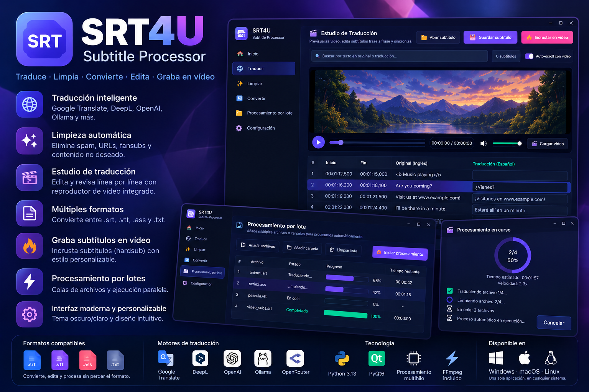

# SRT4U - Subtitle Processor

[](LICENSE)
[](https://python.org)
[](https://pypi.org/project/PyQt6/)
[]()
[]()

[**English**](README.md) | [**Español**](README_es.md)

Aplicación de escritorio para traducir, editar, limpiar y convertir archivos de subtítulos (`.srt`, `.vtt`, `.ass`, `.txt`) con reproductor de vídeo sincronizado en tiempo real e incrustación directa en vídeo (Burn-In / Hardsub).



---

## Funcionalidades principales

- **Interfaz multi-idioma (i18n)**:
  - Detección automática del idioma del sistema operativo al iniciar mediante `QLocale`.
  - Cambio dinámico en tiempo real entre idiomas sin reiniciar la aplicación.
  - 6 idiomas soportados: Español (`es`), Inglés (`en`), Portugués (`pt`), Alemán (`de`), Italiano (`it`) y Chino Simplificado (`zh-CN`).
  - Doble selector: acceso rápido en la barra superior y selector permanente en la página de Configuración.
- **Incrustación en vídeo (Hardsub / Burn-In)**:
  - Quema los subtítulos de forma permanente dentro del archivo de vídeo (`.mp4`, `.mkv`, `.webm`, etc.).
  - Configuración visual personalizada: Tamaño tipográfico, color (Blanco, Amarillo, Cian) y caja de fondo (Caja semitransparente, sólida o solo contorno).
  - Escalado adaptativo según resolución: Los subtítulos mantienen la proporción visual óptima en cualquier resolución (desde 480p hasta 4K y formatos verticales de Reels/TikTok).
  - Corrección automática de solapamientos: Sanitizador que evita que subtítulos con tiempos superpuestos choquen o se monten en pantalla.
  - Modal de progreso en vivo con velocidad de codificación (x), tiempo transcurrido y tiempo restante estimado (ETA).
- **Estudio de traducción y edición interactiva**:
  - Editor en tarjetas divididas para revisar y afinar las traducciones línea por línea en caliente.
  - Sincronización bidireccional con el reproductor de vídeo (al pulsar sobre un subtítulo salta directamente al segundo del vídeo).
  - Búsqueda y filtrado instantáneo de líneas.
- **Motores de traducción**:
  - Google Translate: Capa gratuita integrada lista para usar, sin necesidad de registros ni claves API.
  - DeepL: Soporte para claves API Free y Pro.
  - OpenAI / LLMs locales: Compatible con endpoints de OpenAI, Ollama y OpenRouter.
- **Limpiador automático**: Elimina enlaces de Telegram (`t.me`), URLs, marcas de agua de fansubs, publicidad y notas musicales (`♪`), respetando las etiquetas de formato (`<i>`, `<b>`, estilos ASS).
- **Conversor entre formatos**: Conversión bidireccional entre `.srt`, `.vtt`, `.ass` y texto plano `.txt`.
- **Procesamiento por lote**: Cola de archivos con seguimiento de estado individual por archivo.
- **Analytics y QA determinista**: métricas agrupadas de contenido/tiempos/calidad más validación por reglas (`analyze`/`qa`, JSON/CSV).
- **Benchmarks de traducción**: comparación reproducible de providers con informes JSON/CSV y notebook de análisis.
- **Historial local SQLite**: cada ejecución registrada con métricas agregadas; sin textos, claves ni multimedia.
- **API REST local** (extra `[api]`): `/api/v1` con analyze, QA, jobs, historial, benchmarks y OpenAPI.
- **Transcripción local Whisper** (extra `[transcription]`): audio/vídeo → subtítulos.
- **Pipeline audiovisual**: `srt4u pipeline` / página Pipeline / `POST /api/v1/pipeline` (transcripción → limpieza → analytics → QA → traducción opcional → QA final → exportación → burn-in opcional).
- **CLI headless**: Limpieza, traducción y conversión por lotes; incluye análisis de métricas y QA determinista con exportación JSON/CSV, sin iniciar PyQt6.
- **Ejecución multihilo**: Traducción simultánea de bloques de subtítulos para acelerar el procesamiento.
- **Tema Dark / Light Glassmorphism**: Alternancia instantánea entre modo oscuro y claro con estética moderna translúcida.

---

## Instalación y uso

### Requisitos
- Python 3.10 o superior
- `pip`

### Ejecutar desde código fuente

```bash
# Clonar el repositorio
git clone https://github.com/marodriguezd/SRT4U-Subtitle-Processor.git
cd SRT4U-Subtitle-Processor

# Crear y activar entorno virtual
python -m venv .venv
source .venv/bin/activate  # En Windows: .venv\Scripts\activate

# Instalar dependencias (vía checkout: misma base que `pip install .`)
pip install -r requirements.txt

# Iniciar la aplicación de escritorio
python main.py

# Procesar sin abrir la interfaz
python -m application.cli process input.srt --output output.srt --clean
```

### Extras opcionales

```bash
pip install ".[api]"            # API REST local: srt4u serve (/api/v1, OpenAPI)
pip install ".[transcription]"  # Whisper local: srt4u transcribe / pipeline
pip install ".[dev]"            # pytest + ruff para contribuir
```

La base (GUI + CLI + analytics + QA + traducción + historial + pipeline sobre
subtítulos) viene con la instalación base — tanto `pip install .` como
`pip install -r requirements.txt` la proporcionan, sin extras. Los modelos Whisper nunca se empaquetan: se
descargan una vez con aviso previo (`SRT4U_WHISPER_MODEL_DIR` reubica la caché).

### Quickstart en 60 segundos

```bash
python -m application.cli analyze input.srt --json
python -m application.cli qa input.srt --strict
python -m application.cli process input.srt --clean --translate --target en
python -m application.cli transcribe clip.mp4 --model small --language auto
python -m application.cli pipeline clip.mp4 --translate --target en -o out.srt --stats-json
python -m application.cli serve  # docs en http://127.0.0.1:8000/docs
```

Arquitectura (GUI/CLI/API → servicios → providers/SQLite/FFmpeg) y guías:
[docs/cli.md](docs/cli.md), [docs/api.md](docs/api.md),
[docs/transcription.md](docs/transcription.md), [docs/pipeline.md](docs/pipeline.md),
[docs/database.md](docs/database.md), [docs/tech-debt.md](docs/tech-debt.md).

### Ejecutables autónomos precompilados
GitHub Actions compila automáticamente binarios portables en cada tag de versión. **Vienen con un binario estático de FFmpeg integrado, por lo que funcionan de forma 100% autónoma sin instalar librerías externas**:
- **Windows**: `SRT4U-Windows-x64.exe` (Ejecutable único autocontenido)
- **Linux**: `SRT4U-Linux-x86_64.AppImage` (Portable en cualquier distribución de Linux)
- **macOS**: `SRT4U-macOS.dmg` (Binario Universal para Apple Silicon M1-M4 e Intel)

---

## CLI headless

La CLI reutiliza `SubtitleService` y permite limpiar, traducir, convertir formatos y procesar directorios por lotes sin crear una aplicación Qt. Tras instalar el paquete, usa `srt4u process`; desde el repositorio puedes ejecutar `python -m application.cli process`. También admite presets JSON y opciones como `--translate --source auto --target es --engine ollama`. Consulta [docs/cli.md](docs/cli.md) para ejemplos, claves del preset y detalles de salida.

## Analytics y QA

`analyze` calcula métricas agrupadas de contenido, tiempos, calidad y procesamiento. `qa` detecta problemas deterministas con límites configurables. Ambos comandos admiten JSON; analytics también se puede exportar a CSV. Detalles, reglas y ejemplos de exportación en [docs/analytics.md](docs/analytics.md).

## Proveedores de traducción y métricas

`TranslationService` delega mediante `ProviderRegistry` en `Google`, `DeepL` o el endpoint OpenAI-compatible (`openai`, `llm` y `ollama` comparten implementación; el nombre solicitado se conserva en las métricas). Los errores están normalizados (`error_type`), los reintentos son opt-in y el fallback histórico DeepL/OpenAI→Google es explícito y configurable. `translate_with_metrics()` devuelve `TranslationResult` con `TranslationMetrics` serializable a JSON (provider, modelo, idiomas, cues/caracteres/palabras, duración wall-time, reintentos, fallback, tokens cuando existen, `estimated_cost` en `null`); la CLI los muestra con `--stats` o `--stats-json`. `benchmark` ejecuta un dataset fijo contra varios providers durante N repeticiones y exporta JSON/CSV para análisis offline; `notebooks/benchmark_analysis.ipynb` + `analysis/benchmark_analysis.py` calculan descriptivos, variabilidad, errores/fallback y gráficos en `reports/benchmark/`. Las ejecuciones se registran en un historial local SQLite (CLI `history`, página History, `--store` para benchmarks). Una API REST local (`srt4u serve`, extra `[api]` de FastAPI) expone analyze, QA, jobs de traducción/procesado, historial y benchmarks en `/api/v1` con docs OpenAPI. Transcripción local opcional con Whisper (`srt4u transcribe`, página Transcribir, jobs `POST /api/v1/transcribe`; extra `[transcription]` de `faster-whisper`) que convierte audio/vídeo en subtítulos para Analytics, QA, limpieza, traducción y burn-in. Un orquestador `MediaPipeline` (`srt4u pipeline`, página Pipeline, jobs `POST /api/v1/pipeline`) encadena transcripción/parse → limpieza → analytics → QA → traducción opcional → QA final → exportación SRT/VTT → burn-in opcional, con errores por etapa, cancelación cooperativa y un registro principal en historial. Ver [docs/providers.md](docs/providers.md), [docs/benchmarking.md](docs/benchmarking.md), [docs/benchmark_analysis.md](docs/benchmark_analysis.md), [docs/database.md](docs/database.md), [docs/api.md](docs/api.md), [docs/transcription.md](docs/transcription.md) y [docs/pipeline.md](docs/pipeline.md).

## Pruebas automatizadas

La flota de tests evalúa parseo, limpieza, conversiones entre formatos, traducción gratuita, flujos de interfaz, regresión de layout (detección de texto recortado en 6 idiomas × 2 temas) e invariantes de geometría de diálogos:

```bash
pytest tests/ -m "not network"  # sin red, claves ni modelos Whisper
```

---

## Herramientas de desarrollo

### Generador de galería de capturas

`tools/regenerate_screenshots.py` regenera la galería de verificación visual offscreen utilizada en la revisión de UI: páginas de la ventana principal (Inicio, Ajustes, Acerca de) × idiomas × temas oscuro/claro, más el diálogo de burn-in, los modales de progreso, el diálogo de archivos tematizado (oscuro/claro) y un message box por idioma.

```bash
QT_QPA_PLATFORM=offscreen python tools/regenerate_screenshots.py [--out DIR] [--langs en,es,...]
```

- La salida va por defecto a `/tmp/srt4u-shots` (46 PNG con los 6 idiomas de UI); los PNG previos del directorio se sobrescriben.
- Usa la plataforma offscreen de Qt si no hay display disponible y neutraliza el worker de FFmpeg, por lo que puede ejecutarse headless sin riesgo.
- Imprime el tamaño resultante y el mínimo declarado de cada diálogo como comprobación rápida de geometría (se espera `size == min`).
- La utilidad está protegida contra degradación por el test de humo `tests/test_screenshot_tool.py`, que la ejecuta en un subproceso en cada job de tests de CI.

---

## Logs y solución de problemas

Los fallos se escriben en un archivo de log rotativo (512 KB × 3) en lugar de silenciarse:

| Plataforma | Ubicación |
|---|---|
| Windows | `%APPDATA%\SRT4U\srt4u.log` |
| macOS | `~/Library/Application Support/SRT4U/srt4u.log` |
| Linux | `~/.config/SRT4U/srt4u.log` (o `$XDG_CONFIG_HOME/SRT4U/srt4u.log`) |

Los mensajes propios de Qt también se enrutan ahí (`qWarning`/`qCritical`/`qFatal`, y `qDebug`/`qInfo` a nivel debug), de modo que los avisos de multimedia/códecs y los diagnósticos de los plugins de plataforma aparecen junto a las entradas de la app. Registra fallos de lectura/escritura de la configuración, errores del motor de traducción por bloque, problemas de detección de FFmpeg (duración/dimensiones), excepciones inesperadas (con traza) y el código de salida final. Cuando el fallo afecta al usuario — ajustes no guardados, traducción incompleta, configuración ilegible, error inesperado — la app muestra un diálogo indicando ese archivo.

---

## Formatos soportados

| Formato | Extensión | Lectura | Escritura | Conserva estilos |
|---|---|:---:|:---:|:---:|
| SubRip Subtitle | `.srt` | Sí | Sí | Sí (etiquetas HTML) |
| Web Video Text Tracks | `.vtt` | Sí | Sí | Sí (parámetros de cue y tags) |
| Advanced SubStation Alpha | `.ass` / `.ssa` | Sí | Sí | Sí (estilos y posiciones) |
| Texto plano (diálogo) | `.txt` | Sí | Sí | Solo líneas |

---

## Licencia

Este proyecto está bajo la [Licencia Creative Commons Atribución-NoComercial-CompartirIgual 4.0 Internacional (CC BY-NC-SA 4.0)](LICENSE).
